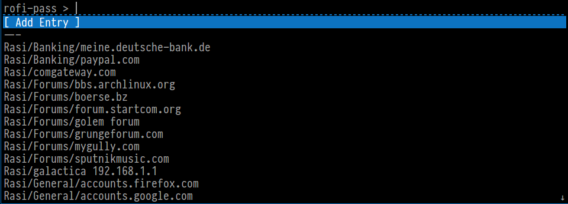

# rofi-pass

#### bash script to handle pass storages in a convenient way



## Features:

* Open URLs of entries with hotkey
* Add new Entries to Password Storage
* Edit existing Entries
* Inline view of complete password entry with ability to
  + Copy individual fields to clipboard
  + Autotype single fields
* Support for multiple roots for password-store (e.g. separate work from private passwords)
* Auto Type User and Password. Format of password files are expected to be like:
```
foobarmysecurepassword
user: MyUser
url: http://my.url.foo
```
* Auto Typing of more than one field. This expects a autotype field in password file.
```
foobarmysecurepassword
---
user: MyUser
SomeField: foobar
AnotherField: barfoo
url: http://my.url.foo
autotype: SomeField :tab UserName :tab AnotherField :tab pass
```
The `:tab` field has a special meaning. this will hit the tab key, obviously.<br>
Same for `:space`, which will hit the space key, can be used to activate checkboxes.
In addition to those `:enter` and `:delay` are available.

* All Hotkeys are configurable in config file
* user, url and autotype field names are also configurable

## Requirements
* pass (https://github.com/zx2c4/password-store)
* sed
* rofi (https://github.com/DaveDavenport/rofi)
* xdotool
* awk
* bash

## Configuration
rofi-pass may read its configuration values from `/etc/rofi-pass` and/or `$HOME/.config/rofi-pass/config`.
For an example configuration please take a look at the included `config.example` file.

## Extras
rofi-pass comes with a tiny helper script, which makes it easier to create new pass entries.
Just run it with 

```
addpass --name "My new Site" +user "zeltak" +branch "branch" +custom "foobar" +autotype "branch :tab user :tab pass"
```

* First argument `--name` is mandatory. This will be the filename of the new password entry.
* Second argument can be `--root` followed by absolute path to your password-store. addpass also uses root config setting from rofi-pass config file. If both are not found, PASSWORD_STORE_DIR variable is checked. If none of the above are found, the default location `$HOME/.password-store` is used.

* Fieldnames are defined with `+` and the actual value is defined inside the quotations. You can add as many fields as you like

Also included is an import script for keepass2 databases. It's the same script that can be downloaded from the pass homepage, with some minor modifications to match rofi-pass structure.
