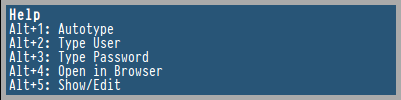

# rofi-pass

#### bash script to handle pass storages in a convenient way


## rofi-pass has the following features:

* Auto Type User and Password. Format of password files are expected to be like:
```
foobarmysecurepassword
UserName: MyUser
URL: http://my.url.foo
```
* Auto Typing of more than one field. This expects a CustomOrder field in password file:
```
foobarmysecurepassword
UserName: MyUser
SomeField: foobar
AnotherField: barfoo
URL: http://my.url.foo
CustomOrder: SomeField UserName AnotherField
```
* Open URLs of entries with hotkey
* Add new Entries to Password Storage
* Edit existing Entries

Because rofi-pass is 100% hotkey based, it comes with a little help screen. (Using notifications for now - Open for better ideas)



## Requirements
* pass (https://github.com/zx2c4/password-store)
* sed
* rofi (https://github.com/DaveDavenport/rofi)
* wmctrl
* xprop
* xdotool
* awk
* bash
